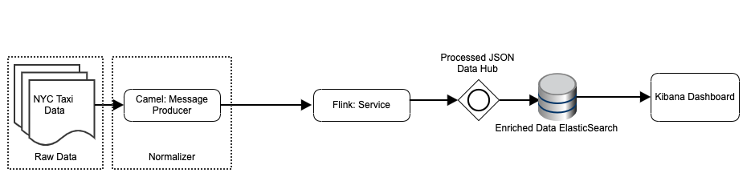

# Streaming Data Pipeline

The purpose of this Application is to provide a streaming ETL pipeline implementing a Lambda architecture.

## Requirements

- Java JDK1.8
- Docker (docker agent must be running)
- Docker-Compose

## Architecture overview

## Build From Scratch

The buildsystem is based on `maven`. To build all the components just enter:

`
$ ./mvnw clean install
`

Beforehand the build process, Maven will be automatically downloaded and installed.
When the build is finished successfully you can startup your system. 

## Starting Up

In the root folder you find a `docker-compose.yml` file from which a docker based runtime is orchestered.

Startup the complete system

`
$ docker-compose up
`

Shutdown the complete system

`
$ docker-compose down
`

## Technologies

When starting up the system the following components running in its own docker containers will be started:
Flink-app
Camel-app
zookeeper
Kafka-gateway
mongo-gateway
Kibana
Elasticsearch

### Apache Kafka

Apache Kafka (https://kafka.apache.org/) is an open-source stream-processing software platform developed by LinkedIn and donated to the Apache 
Software Foundation, written in Scala and Java. The project aims to provide a unified, 
high-throughput, low-latency platform for handling real-time data feeds

### Apache Flink

Apache Flink (https://flink.apache.org/) is an open-source stream-processing framework developed by the Apache Software Foundation. The core of Apache Flink is a distributed streaming data-flow engine written in Java and Scala

### Apache Camel

Apache Camel (https://camel.apache.org/) is an open source framework for message-oriented middleware with a rule-based routing and mediation engine that provides a Java object-based implementation of the Enterprise Integration Patterns using an application programming interface (or declarative Java domain-specific language) to configure routing and mediation rules.

### Elastic Search

Elasticsearch (https://www.elastic.co/) is a search engine based on the Lucene library. It provides a distributed, multitenant-capable full-text search engine with an HTTP web interface and schema-free JSON documents. Elasticsearch is developed in Java.

### Kibana

Kibana (https://www.elastic.co/products/kibana) is an open source data visualization plugin for Elasticsearch. It provides visualization capabilities on top of the content indexed on an Elasticsearch cluster. Users can create bar, line and scatter plots, or pie charts and maps on top of large volumes of data.

### MongoDB

MongoDB (https://www.mongodb.com/) is a cross-platform document-oriented database program. Classified as a NoSQL 
database program, MongoDB uses JSON-like documents with schemata. MongoDB is developed by MongoDB Inc. and licensed 
under the Server Side Public License (SSPL).

### Docker

Docker (https://www.docker.com/) is a collection of interoperating software-as-a-service and platform-as-a-service offerings that employ operating-system-level virtualization to cultivate development and delivery of software inside standardized software packages called containers.

## ASCII Artgenerator for startup banner 
http://patorjk.com/software/taag/#p=display&f=Standard&t=BannerText
